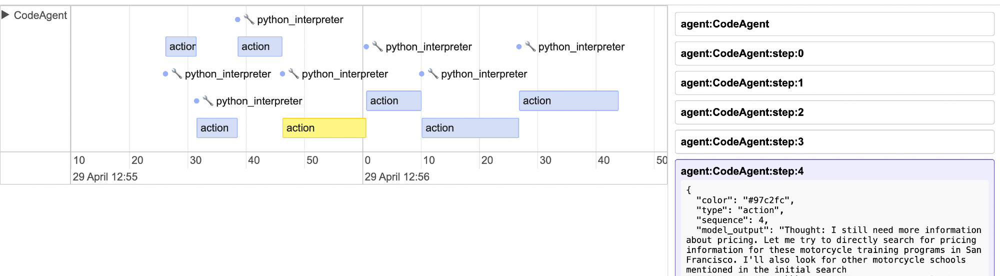
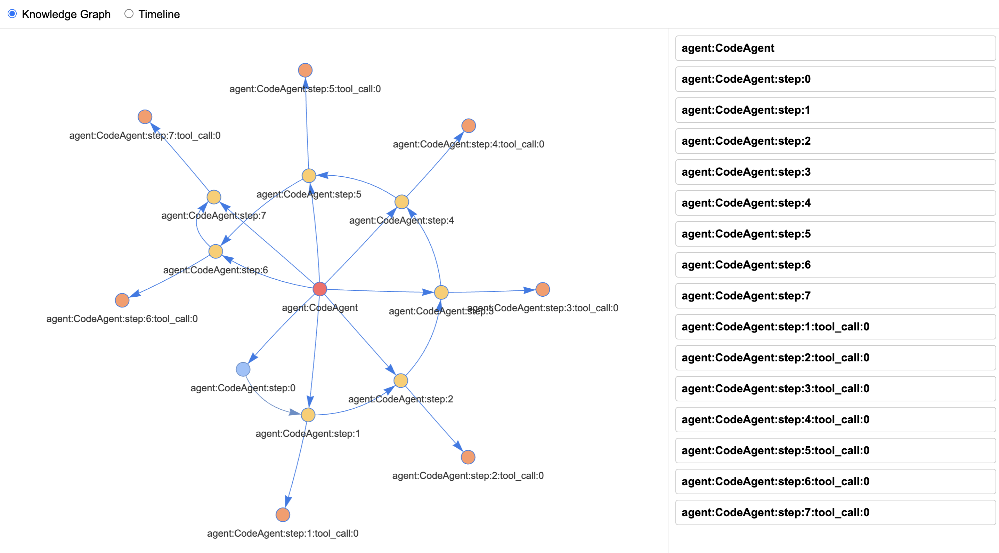

# Mechifact ⚡

**Multi-Agent System Observability Platform** 🔍

Gain complete visibility into complex multi-agent systems. Monitor every tool call, trace agent interactions, and debug distributed workflows with comprehensive observability designed for modern AI architectures.

[Join Waitlist](https://www.mechifact.com/)

## The Problem

Complex agentic systems are **difficult to debug, measure, and improve**. As AI agents become more sophisticated and work together in distributed architectures, understanding what's happening under the hood becomes increasingly challenging:

- **Tool calls** happen across multiple agents with no unified view
- **Agent coordination** is opaque and hard to trace
- **System debugging** requires piecing together logs from different sources
- **Performance bottlenecks** are hidden in complex interaction patterns

## The Solution

Mechifact provides comprehensive observability for multi-agent systems through three core capabilities:

### 🔧 Tool Call Tracing
Monitor every tool invocation across your multi-agent system with detailed execution traces and performance metrics.



### 🤝 Agent Coordination  
Visualize how agents communicate, coordinate, and share information across your distributed system architecture.



### 🐛 System Debugging
Debug complex multi-agent workflows with comprehensive logs, error tracking, and performance bottleneck identification.

## Quick Start

### Prerequisites
- Python 3.8+
- OpenAI API key or compatible LLM provider

### Installation

1. **Clone the repository**
   ```bash
   git clone https://github.com/your-org/mechifact.git
   cd mechifact
   ```

2. **Install dependencies**
   ```bash
   pip install -r requirements.txt
   pip install flask python-dotenv markdownify  # for live server
   pip install networkx pyvis  # for visualizations
   ```

3. **Set up environment**
   ```bash
   cp .env.example .env
   # Edit .env with your LLM API keys
   ```

### Run Live Observability Server

Start the real-time monitoring interface:

```bash
python live_server.py
```

Open [http://localhost:8000](http://localhost:8000) in your browser and start giving tasks to your agent. Watch as tool calls, agent interactions, and system state changes appear in real-time.

### Generate Static Visualizations

Create knowledge graph visualizations from agent execution logs:

```bash
# Generate knowledge graph
python 01-knowledge-graph/viz_knowledge_graph.py output/proof_of_work_*.json

# Generate combined timeline + graph view
python 02-timeline/viz_multi_view.py output/proof_of_work_*.json
```

## Features

- **Real-time Monitoring**: Live web interface showing agent steps as they happen
- **Knowledge Graph**: Interactive visualization of agent relationships and data flow  
- **Timeline View**: Chronological trace of all tool calls and agent actions
- **Multi-View Dashboard**: Combined graph, timeline, and detailed logs
- **Framework Agnostic**: Built on [smolagents](https://github.com/huggingface/smolagents) with extensible architecture

## Architecture

Mechifact works by:

1. **Instrumenting** your multi-agent system to capture provenance data
2. **Streaming** real-time events to the observability dashboard  
3. **Visualizing** agent interactions through multiple complementary views
4. **Analyzing** performance patterns and debugging information

